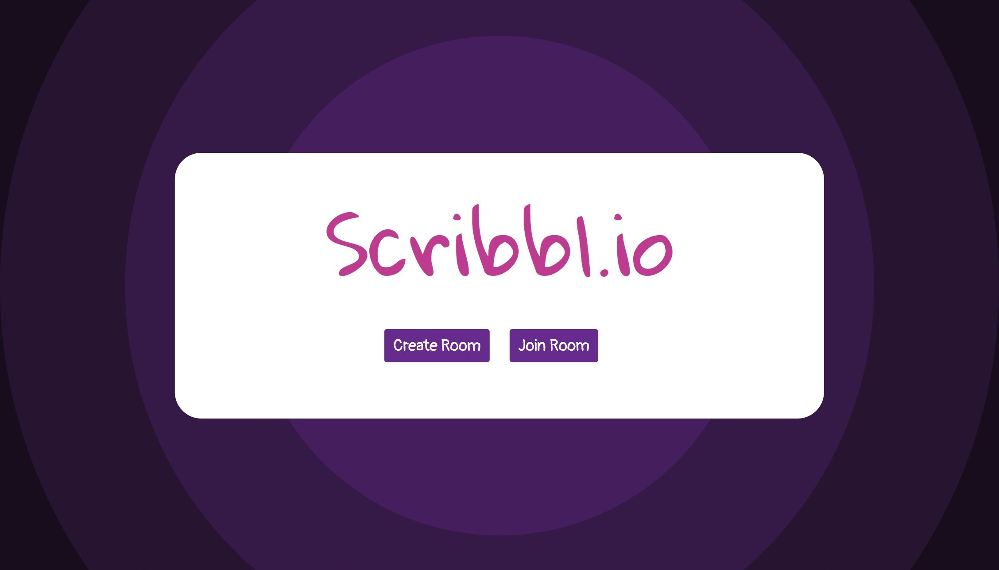
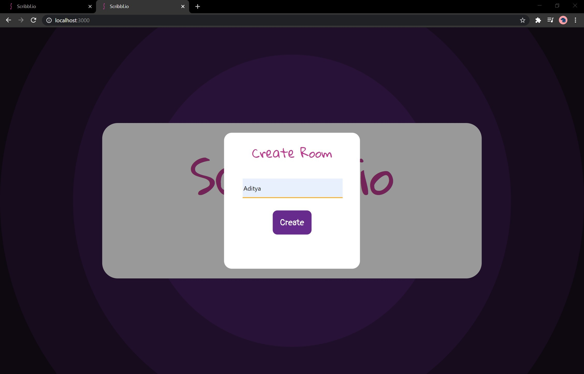
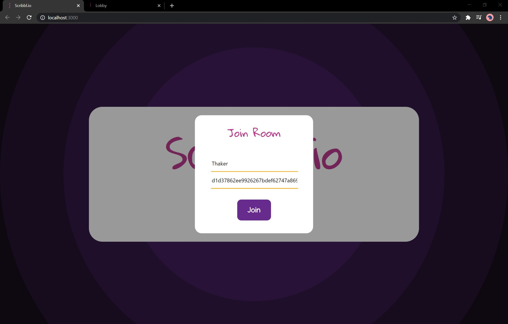
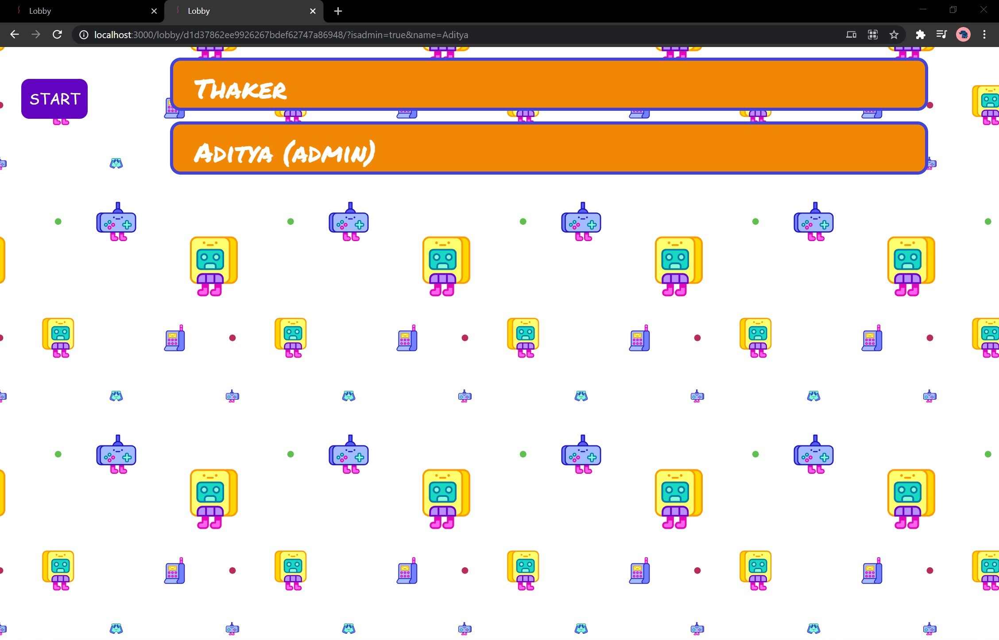
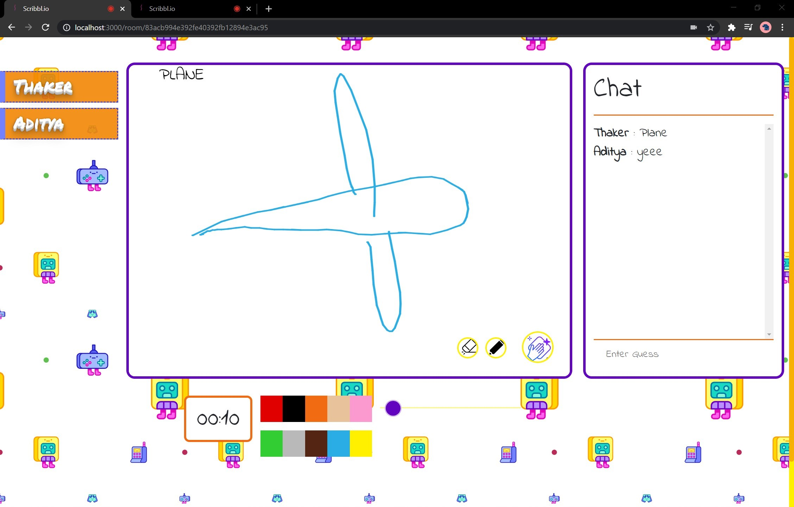
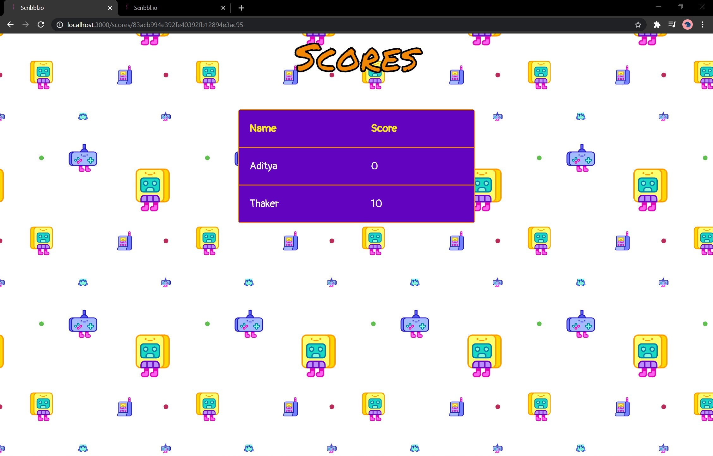

# Scribbl

Scribbl is an online multiplayer turn-based guessing game; clone of the original Skribbl.io
This project also features WebRTC voice chat.

## Home Page

## Create Page

## Join Page

## Lobby Page

## GamePlay (Drawing player's screen)

## Scoreboard 

## Technologies and Frameworks used:

* Nodejs
* Expressjs
* Socketio
* Redis
* WebRTC

## Commands to recreate project:

> npm install

> npm start